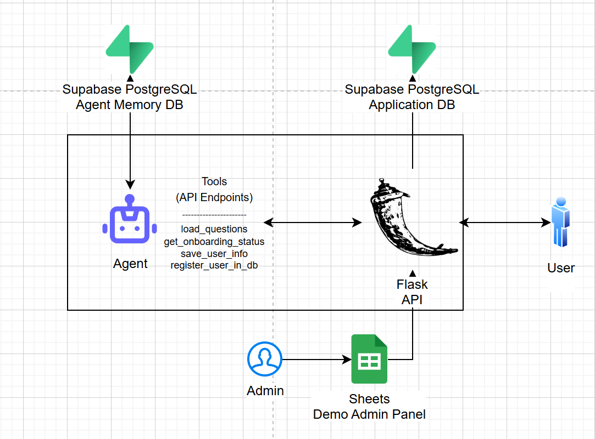

# Agentic Onboarding System

Submission for Google Agents Intensive Course Capstone Project

https://www.kaggle.com/competitions/agents-intensive-capstone-project#tracks-and-awards

This is an agentic onboarding system that adds an alternative to legacy registration forms, and allows users to register to a system with a natural conversation.
The agent sits behind a regular API, helps generate chat messages and triggers API endpoint calls as tool calls based on the nature of the conversation.

## Problem Statement
Lack of engagement and repetitiveness in legacy form registrations is the main problem. These forms are repetitive across all platforms and users find them boring. Niche questions added to understand users in depth are not successful, because users just want to fill the form and finish the process.

Within the agentic onboarding system, the user has to follow a natural conversation to register to the system. It can be personalized and incentivized to get more and accurate information, and make the processes more engaging for the users.

## Why agents? -- Why are agents the right solution to this problem
Agents, because the designed registration process is not linear. The conversation can go in different ways. Users can answer different questions at different parts of the conversation, the agent can use its "agency" to retrieve what questions  to ask. Different sets of questions can be asked to different types of users, and agentic onboarding can help with that by classifying users during the registration and responding in real time.

## What you created -- What's the overall architecture? 

This is a Flask app, that contains a legacy form registration, and there's an agent that has access to the endpoints of this API as its tools. By using these endpoints and generating chat responses the agent allows an agentic onboarding system.

Database session service is used as the memory of the agent and it is linked to a PostgreSQL instance in Supabase. Additionally, there's an application database that holds the registered user information. The onboarding questions are not a static set of questions, they can be changed in the demo admin panel which is simply a Google Sheets table. The user solely interacts with the API, however, the agent that sits back in the application helps run the processes.

The key solution in this design is the position of the agent. This design can be applied to any other API, and the agent that is in use or its different functionalities can easily be changed. The main application still relies on its API endpoints.

## Demo -- Show your solutions

## The Build
- Google Agent Development Kit (ADK)
- Flask
- Google Sheets API
- Supabase PostgreSQL DBs

- For the agent, check out `agent.py` inside `custom_funcs/agents/`.
- If you want to reproduce the app, you can use the repo; however, you need to provide your own secrets in a `.env` file. Additionally, you either need to set up another admin panel sheet and create a `google_sheet_credentials.json` in the root, or simplpy give the app a set of static questions, and customize it however you want. 
- The main agent design is there to use. That and anything else is easy to change. This is not a complex app, but the design can be useful, and the system can be customized for everyone's needs.

## If I had more time, this is what I'd do
- I would turn this into a multi agent system, create scenarios for different types of users and how agents should interact with each of them.
- I would assign a single agent for all data handling operations, and would add more dynamism to questions to be asked.
- I would make the user aware that the process can be finished early, and I would prompt engineer it in a way that the conversation is more engaging.
- I would make it so that the agent builds a context, maybe a knowledge graph of a user based on given taxonomy and how a user relates to the entities in there, and make an agent save this result as well.